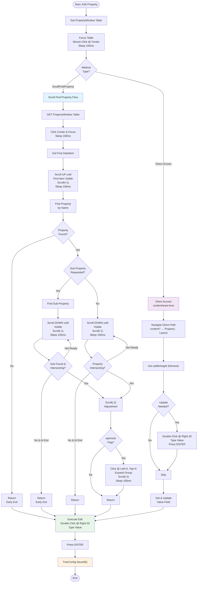

---

# Summary: Property Selection Replication Plan

## What We're Replicating

You want to translate 5 interconnected C# methods from `MappView.cs` into Robot Framework keywords:

| Method | Purpose | Complexity |
|--------|---------|-----------|
| **ScrollFindProperty()** | Helper: Locates and optionally expands properties in scrollable table | High |
| **EditSize()** | Sets widget width/height | Medium |
| **EditPosition()** | Sets widget top/left position | Medium |
| **EditValue()** | Sets data binding (triggers modal) | High |
| **EditText()** | Sets widget text label | Low |

## Key Findings

### Similarity to Existing Code

Your existing Robot keywords already handle similar patterns:

1. **Add User Role in Role.role** (component_keywords.robot:98)
   - Uses: Click, TreeItem selection, Double-Click, Type, ENTER
   - Different: Works with ConfigWorkspace tree (simpler structure)

2. **Fill TMX Entries** (component_keywords.robot:41)
   - Uses: Find elements, double-click, type, press keys
   - Different: Works with table rows (simpler navigation)

**Difference**: Your new keywords must handle scrollable, hierarchical tables with:
- Variable visibility (requires scrolling to see)
- Deep nesting (Group → Sub-Group → Property)
- Pixel-perfect click positioning
- Conditional logic based on flags

### Common Pattern Across All Edit* Methods

```
1. Get PropertyWindow table
   ↓
2. Navigate to target property (scroll if needed)
   ↓
3. Locate value field (double-click point)
   ↓
4. Double-click field @ precise position (Right-20 px)
   ↓
5. Type value (with prefix if text)
   ↓
6. Press ENTER
   ↓

### Scroll Logic - The Tricky Part
```
START (items may be above or below viewport)
  ↓
IF sub-property:
  ↓
FINAL ADJUSTMENT: Scroll(-2)
  ↓
END

### Content vs Area Flags
- **content/area = false**: Standard scroll path - handles all cases

- **Standard**: Layout → Size → width/height

## Implementation Plan Overview

### Phase 1: Foundation (1-2 hours)
1. **Extend Python wrapper**: Add `GetPropertyWindowXPath()` function
2. **Test xpath access**: Verify we can get PropertyWindow table from Robot

### Phase 2: Helper Keywords (2-3 hours)
1. **Scroll Find Property** - The lynchpin, most complex
2. **Property Table Focus** - Repeated pattern extracted
3. **Get Property Value** - Parse current value
4. **Edit Property Field** - Double-click + type + ENTER

### Phase 3: Main Keywords (2-3 hours)
1. **Edit Widget Size** - Uses both direct and scroll paths
2. **Edit Widget Position** - Similar to Size, extra visibility checks
3. **Edit Widget Text** - Simple, just scroll to path
4. **Edit Widget Value** - Complex, involves modal window

### Phase 4: Integration & Testing (2-3 hours)
1. Unit test each keyword individually
2. Test with actual Automation Studio UI
3. Validate mouse/keyboard sequences
4. Compare with C# execution videos/logs

**Total Estimated Time**: 7-11 hours development + testing

## File Structure

```
NEW FILE: RobotTests/keywords/widget_property_keywords.robot
├─ Scroll Find Property                 (foundation)
├─ Edit Widget Size                     (composite)
├─ Edit Widget Position                 (composite)
├─ Edit Widget Value                    (composite + modal)
├─ Edit Widget Text                     (composite)
└─ Helper Keywords
   ├─ Focus Property Window
   ├─ Get Property Element
   ├─ Edit Property Field Value
   └─ etc.

MODIFIED FILES:
├─ FlaUILibrary/python/flaui_wrapper.py (add GetPropertyWindowXPath)
└─ component_keywords.robot             (maybe reference new keywords)
```

## Critical Success Factors

1. **Pixel-Perfect Mouse Control**
   - Right - 20 = where the value edit field actually is
   - Left + 5, Top + 5 = collapse/expand buttons
   - These must be exact

2. **Scroll Logic Accuracy**
   - Must handle both "property above viewport" and "property below viewport"
   - Must recognize when property doesn't exist
   - Must stop at list boundaries

3. **Timing**
   - 100ms sleeps critical for UI responsiveness
   - 500ms polling for modals
   - Cannot go faster without risking missed elements

4. **Element Intersection Checks**
   - Core to determining visibility
   - Must replicate C#'s `IntersectsWith()` behavior
   - FlaUILibrary must support this

5. **Conditional Paths**
   - content vs area vs standard flags change navigation
   - Modal window handling is unique to EditValue
   - Text prefix "$IAT/" required for EditText

## References & Examples

- ✅ Element navigation: MappView.cs lines 455-495

**C# to Review**:
- MappView.cs lines 495-641 (all Edit* methods and ScrollFindProperty)
- IDE_Main.cs lines 920-960 (reference for AddRole pattern)

**FlaUILibrary Keywords to Leverage**:
- Click, Double Click
- Find One Element, Find All Elements
- Press Key
- Sleep
- Mouse positioning

## Risks & Mitigations

| Risk | Mitigation |
|------|-----------|
| Pixel positioning off by a few px | Use visual debugging, capture coordinates |

## Deliverables

1. ✅ **This Plan Document** - Comprehensive breakdown
2. ✅ **Flowchart** - Visual representation of logic
3. ⏳ **widget_property_keywords.robot** - All new keywords
4. ⏳ **Enhanced Python wrapper** - GetPropertyWindowXPath()
5. ⏳ **Unit tests** - Validate each keyword
6. ⏳ **Integration tests** - Full scenario testing

---

**Next Steps**:
1. Review this plan and flowchart
2. Approve the structure and approach
3. Start Phase 1: Python wrapper enhancement
4. Proceed sequentially through phases
